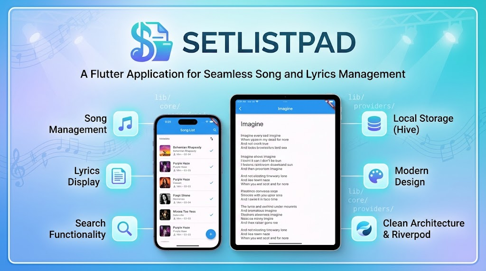

# SetlistPad
<p align="center">
  
</p>
**SetlistPad** is a Flutter application designed to help musicians, singers, and music enthusiasts manage and organize their song lyrics in one place.

## Features

- 🎵 **Song Management**: Create, edit, and organize songs with complete metadata
- 📋 **Lyrics Display**: Access and view song lyrics with a clean, readable interface
- 🔍 **Search Functionality**: Easily find songs and lyrics
- 💾 **Local Storage**: Offline access to your song library with Hive
- 🎨 **Modern Design**: Intuitive and responsive user interface

## Architecture

The project follows a **Feature-First + Clean Architecture** pattern:

```
lib/
├── core/
│   ├── clients/       # HTTP clients and DTO models
│   ├── config/        # Global configuration and constants
│   ├── providers/     # Dependency injection with Riverpod
│   ├── services/      # Business logic services
│   └── theme/         # Themes and typography
├── features/
│   ├── songs/         # Songs feature module
│   └── playlists/     # Playlists feature module
└── main.dart
```

## Tech Stack

- **Framework**: Flutter 3.x
- **State Management**: Flutter Riverpod 2.x
- **Local Database**: Hive
- **HTTP Client**: http
- **Language**: Dart with strong typing

## Requirements

- Flutter 3.0 or higher
- Dart 3.0 or higher
- iOS 11.0+ / Android 5.0+

## Installation

1. Clone the repository:
   ```bash
   git clone https://github.com/HaroldRomero151199/SetlistPad.git
   cd SetlistPad
   ```

2. Install dependencies:
   ```bash
   flutter pub get
   ```

3. Run the application:
   ```bash
   flutter run
   ```

## Development

### Code Analysis
```bash
flutter analyze
```

### Run Tests
```bash
flutter test
```

### Build for Production
```bash
flutter build apk      # Android
flutter build ios      # iOS
```

## Development Guidelines

See [`AGENTS.md`](./AGENTS.md) for mandatory development rules, architectural patterns, and best practices.

## License

This project is licensed under the MIT License.

## Author

[Harold Romero](https://github.com/HaroldRomero151199)
