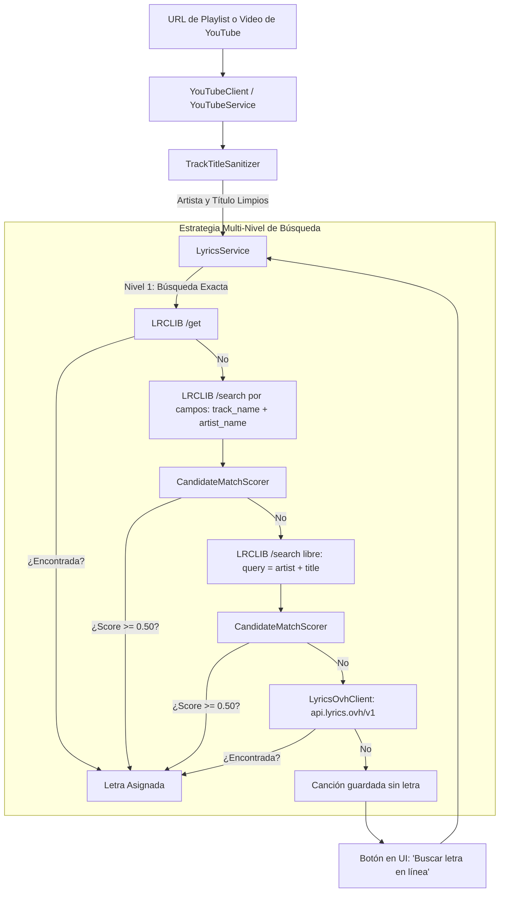

# Documentación Técnica: Motor de Búsqueda Inteligente de Letras e Importación de Playlists

Esta documentación describe la arquitectura, algoritmos, tecnologías y flujos implementados en **SetlistPad** para resolver el problema de canciones sin letra al importar listas de reproducción de YouTube (especialmente de conciertos, tours, festivales y sesiones en vivo), así como el motor de coincidencia y verificación de candidatos.

---

## 1. Contexto y Problema

### El Desafío
Al importar listas de reproducción de YouTube (como playlists con más de 50 canciones en vivo o de conciertos), se presentaban dos limitaciones críticas:
1. **Ausencia de letras en YouTube**: La mayoría de las actuaciones en vivo, grabaciones de conciertos y videos no oficiales no cuentan con subtítulos incrustados ni letras proporcionadas por la plataforma.
2. **Ruido en los títulos**: Los títulos de videos en YouTube suelen tener texto extra que no forma parte de la canción original, por ejemplo:
   - `Air Supply - Making Love Out of Nothing at All (Tour Concert - The Florida Theatre, Jacksonville)`
   - `Radiohead Perform "Creep" Live on September 14, 1993 | Late Night with Conan O’Brien`
   - `Bon Jovi “Livin’ on a Prayer” Live Reunion | Rock Hall 2018 Induction`
   - `Numb (2017 One More Light World Tour - Amsterdam) - Linkin Park`
   - `Goo Goo Dolls-Iris-Live At Camp Krim 8/15/13`

Al consultar directamente las APIs de letras con estos títulos ruidosos, las búsquedas exactas (`/get`) fallaban con `404 Not Found`, y las búsquedas generales arrojaban candidatos irrelevantes o listas vacías.

---

## 2. Tecnologías y Servicios Utilizados

| Tecnología / Servicio | Tipo / Propósito | Características Clave |
| :--- | :--- | :--- |
| **LRCLIB API** | Proveedor principal de letras | • API comunitaria y open source (`https://lrclib.net/api`).<br>• Provee letras sincronizadas (LRC) y letras planas (`plainLyrics`).<br>• No requiere autenticación ni API key.<br>• Endpoints: `/get` (búsqueda estricta) y `/search` (búsqueda difusa y por campos). |
| **Lyrics.ovh API** | Proveedor de respaldo (*fallback*) | • Servicio público gratuito (`https://api.lyrics.ovh/v1/{artist}/{title}`).<br>• Amplia base de datos de letras en texto plano.<br>• Libre de API keys y de configuración previa. |
| **YouTube Web & Atom Feeds** | Extracción de playlists | • `https://www.youtube.com/feeds/videos.xml?playlist_id=...` y extracción web de `ytInitialData`.<br>• Permite obtener títulos, autores y videos sin requerir cuenta de desarrollador en Google Cloud Console ni límites de cuotas de YouTube Data API v3. |
| **Flutter Riverpod (3.x)** | Gestión de estado y DI | • Arquitectura basada en `Notifier` y `Provider`.<br>• Separación desacoplada entre capa de datos, lógica de negocio y presentación. |
| **Hive** | Persistencia local NoSQL | • Almacenamiento rápido en disco sin dependencias de SQLite nativo.<br>• Cajas de almacenamiento (`songs` y `playlists`) serializadas mediante TypeAdapters. |

---

## 3. Arquitectura del Flujo de Datos



---

## 4. Componentes Desarrollados

### 4.1. Sanitizador de Títulos ([TrackTitleSanitizer](file:///C:/flutter/SetlistPad-issue-7/lib/core/services/utils/track_title_sanitizer.dart))
Encargado de aislar el nombre real del artista y el título de la canción a partir de títulos caóticos:
- **Eliminación de ruido entre paréntesis/corchetes**:
  Filtra expresiones como `(Live...)`, `[Official Video]`, `(Concert...)`, `(Tour - ...)`, `(Remastered)`, `(Acoustic)`, `(En Vivo)`, `[HD]`, `(Festival...)`, etc.
- **Detección de patrones con comillas y verbos de interpretación**:
  - `Radiohead Perform "Creep" Live...` ➔ Extrae Artista: `Radiohead`, Título: `Creep`.
  - `Bon Jovi “Livin’ on a Prayer” Live Reunion...` ➔ Extrae Artista: `Bon Jovi`, Título: `Livin' on a Prayer`.
- **Inversión de orden Título - Artista**:
  Detecta casos como `Numb (2017 Tour) - Linkin Park`, donde el canal o autor coincide con la segunda parte para asignar correctamente Artista: `Linkin Park` y Título: `Numb`.
- **Cadenas de guiones no espaciados**:
  Convierte `Goo Goo Dolls-Iris-Live At Camp Krim...` en Artista: `Goo Goo Dolls` y Título: `Iris`.
- **Preservación de palabras compuestas**:
  Garantiza que palabras o nombres legítimos con guion (como `Anti-Hero` o `Jay-Z`) no se dividan erróneamente.

### 4.2. Motor de Scoring y Relevancia de Candidatos ([CandidateMatchScorer](file:///C:/flutter/SetlistPad-issue-7/lib/core/services/utils/candidate_match_scorer.dart))
Da respuesta directa al requerimiento de no aceptar ciegamente cualquier respuesta devuelta por los endpoints de búsqueda:
- **Normalización de texto**: Convierte a minúsculas, elimina puntuaciones y descarta *stop words* no significativas (`the`, `a`, `an`, `and`, `&`, `feat`, `ft`, `with`, etc.).
- **Similitud de Artista**:
  - Coincidencia exacta: `1.0`.
  - Contención de subcadenas: `0.85 - 1.0` (útil cuando la API devuelve `Coldplay feat. ...` y nosotros buscamos `Coldplay`).
  - Coeficiente de Jaccard sobre conjuntos de tokens en caso de diferencias ortográficas.
- **Similitud de Título**:
  - Evalúa la intersección de palabras clave entre el título buscado y el devuelto por la API.
- **Puntuación Ponderada Compuesta**:
  $$\text{Score} = (\text{Puntaje Artista} \times 0.45) + (\text{Puntaje Título} \times 0.55)$$
  *(Si el artista original era desconocido, el puntaje se basa al 100% en el título).*
- **Umbral de Aceptación**:
  Filtra y descarta automáticamente todo resultado con $\text{Score} < 0.50$, garantizando que nunca se adjunten letras de canciones equivocadas.
- **Selección del Mejor Candidato**:
  De todos los candidatos que superen el umbral y contengan letra (`plainLyrics` o `syncedLyrics`), selecciona el de mayor puntaje.

### 4.3. Cliente de Respaldo ([LyricsOvhClient](file:///C:/flutter/SetlistPad-issue-7/lib/core/clients/lyrics_ovh_client.dart))
- Implementa peticiones HTTP directas hacia `https://api.lyrics.ovh/v1/{artist}/{title}`.
- Maneja codificación de URLs para caracteres especiales y retorno `null` seguro en caso de `404` o problemas de red.

### 4.4. Orquestador de Letras ([LyricsService](file:///C:/flutter/SetlistPad-issue-7/lib/core/services/lyrics_service.dart))
Coordina de forma transparente la estrategia escalonada:
1. Limpia los datos de entrada con `TrackTitleSanitizer`.
2. Intenta coincidencia exacta en LRCLIB.
3. Si no hay éxito, realiza búsqueda por campos en LRCLIB y evalúa candidatos con `CandidateMatchScorer`.
4. Si no hay éxito, realiza búsqueda libre en LRCLIB evaluando candidatos con `CandidateMatchScorer`.
5. Si no hay éxito, consulta a `LyricsOvhClient`.
6. Si la letra devuelta está en formato sincronizado LRC (`[00:12.34] Letra...`), limpia los timestamps para presentar texto legible.

### 4.5. Interfaz de Usuario y Búsqueda On-Demand ([SongDetailScreen](file:///C:/flutter/SetlistPad-issue-7/lib/features/songs/presentation/screens/song_detail_screen.dart))
- Si una canción no tiene letra al momento de la importación, el usuario no queda bloqueado: la pantalla muestra un estado vacío interactivo con el botón **"Buscar letra en línea"** (`FilledButton.icon`).
- La barra superior (`AppBar`) incluye un botón con icono de descarga para forzar o actualizar la búsqueda de letra en cualquier momento.
- Notificaciones `SnackBar` localizadas informan sobre el éxito o el fallo de la búsqueda.

---

## 5. Estructura de Archivos (Principio de Una Clase por Archivo)

Se respetó de manera estricta la regla arquitectónica de **una sola clase por archivo** y la modularidad por capas (*Vertical Slicing*):

```
lib/
├── core/
│   ├── clients/
│   │   ├── models/
│   │   │   ├── get_lyrics_request.dart         # DTO petición exacta LRCLIB
│   │   │   ├── search_lyrics_request.dart      # DTO búsqueda LRCLIB (q, track_name, artist_name)
│   │   │   ├── lrclib_response.dart            # DTO respuesta LRCLIB
│   │   │   ├── lyrics_ovh_response.dart        # DTO respuesta Lyrics.ovh
│   │   │   ├── lrclib_models.dart              # Archivo barrel de modelos
│   │   │   └── ...
│   │   ├── lrclib_client.dart                  # Cliente HTTP para LRCLIB
│   │   ├── lyrics_ovh_client.dart              # Cliente HTTP para Lyrics.ovh
│   │   └── clients.dart                        # Archivo barrel de clientes
│   ├── services/
│   │   ├── utils/
│   │   │   ├── track_title_sanitizer.dart      # Sanitizador y extractor de títulos
│   │   │   └── candidate_match_scorer.dart     # Motor de scoring y ranking difuso
│   │   ├── lyrics_service.dart                 # Orquestador multi-proveedor
│   │   ├── youtube_service.dart                # Extracción y parsing de videos/playlists
│   │   └── services.dart                       # Archivo barrel de servicios
│   ├── providers/
│   │   └── providers.dart                      # Configuración de Riverpod (DI)
├── features/
│   ├── songs/
│   │   ├── presentation/
│   │   │   ├── providers/
│   │   │   │   └── songs_notifier.dart         # fetchAndSaveLyrics & importSongsBatch
│   │   │   └── screens/
│   │   │       └── song_detail_screen.dart     # Botón y acción de búsqueda on-demand
│   └── playlists/
│       └── presentation/
│           └── widgets/
│               └── import_playlist_dialog.dart # Modal interactivo de importación
```

---

## 6. Pruebas y Validación

El conjunto completo de pruebas automatizadas se ejecutó en Windows con éxito rotundo:

```powershell
flutter test
```
- **Resultado**: `74 passed, 0 failed` (100% de éxito).
- **Cobertura de pruebas**:
  - `track_title_sanitizer_test.dart`: Validación de los 15 patrones reales de títulos de conciertos y listas de reproducción.
  - `candidate_match_scorer_test.dart`: Validación de similitud exacta, similitud difusa, descarte de canciones no relacionadas y selección del mejor candidato.
  - `lyrics_ovh_client_test.dart`: Simulación con `MockClient` para respuestas 200, 404 y validación de parámetros vacíos.
  - `lyrics_service_test.dart`: Validación de cascada de niveles (LRCLIB exacto ➔ búsqueda con scoring ➔ fallback a Lyrics.ovh).
  - `songs_notifier_test.dart`: Pruebas de importación por lotes e integración con repositorios.
  - `song_detail_screen_test.dart`: Prueba de widget que verifica la presencia del botón "Buscar letra en línea" y las acciones del AppBar.

```powershell
dart analyze
```
- **Resultado**: `No issues found!` (0 advertencias, 0 errores).
